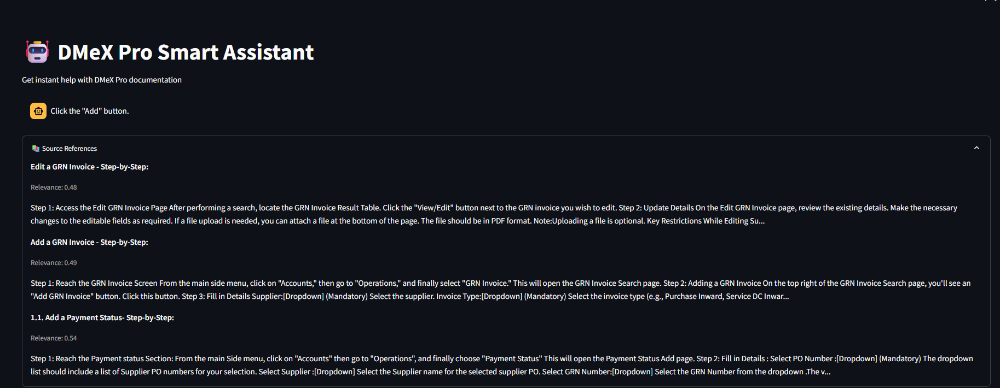

# RAG

This repository contains a Retrieval-Augmented Generation (RAG) model developed specifically for DMeX Pro Documentation using Python and Streamlit.

## Project Overview

The RAG model enhances language generation by incorporating external knowledge retrieved from documentation, providing more accurate and contextually relevant responses for DMeX Pro users. The application is built with Python and features an interactive interface using Streamlit.

## Features

- Retrieval-Augmented Generation for technical documents
- Built with Python for robust backend processing
- Interactive Streamlit UI for ease of use
- Tailored for DMeX Pro Documentation

## Installation

1. **Clone the repository:**
   ```bash
   git clone https://github.com/YuvanShankar2006/RAG-.git
   cd RAG-
   ```

2. **Install dependencies:**  
   *(Add the contents of requirements.txt here when available.)*
   ```bash
   pip install -r requirements.txt
   ```

3. **Run the application:**
   ```bash
   streamlit run app.py
   ```

## Usage

- Launch the Streamlit app to interact with the RAG model.
- Input your queries related to DMeX Pro.
- Receive enhanced, context-aware answers based on the documentation.

## Repository Structure

- `app.py` – Main Streamlit application.  
- `requirements.txt` – Python package dependencies.  
- `README.md` – Project overview and instructions (this file).

*(Add more files and folders as relevant after reviewing repository contents.)*

## Screenshots



## Contact

For questions or support, open an issue or contact [YuvanShankar2006](https://github.com/YuvanShankar2006).
